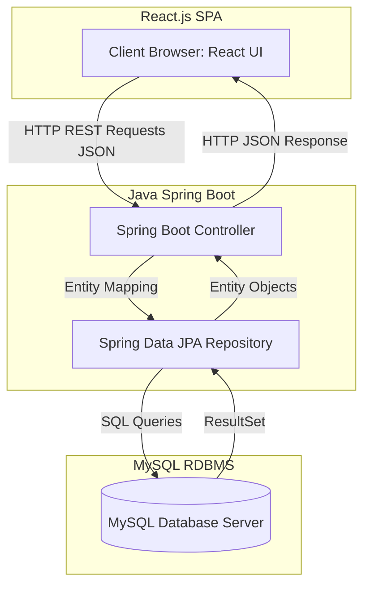
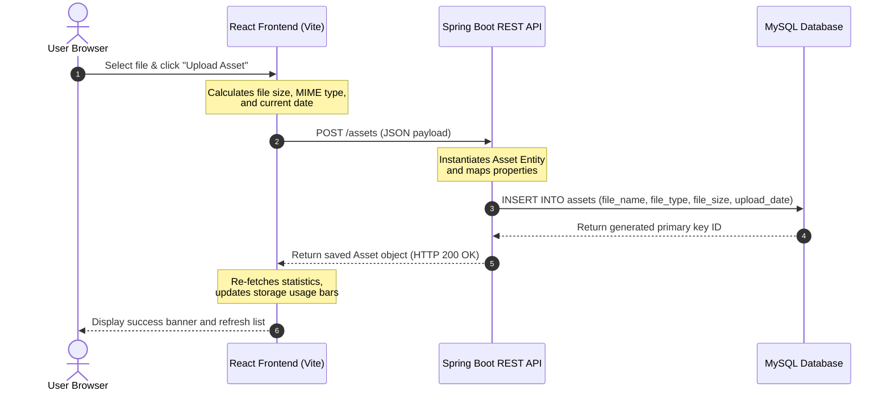
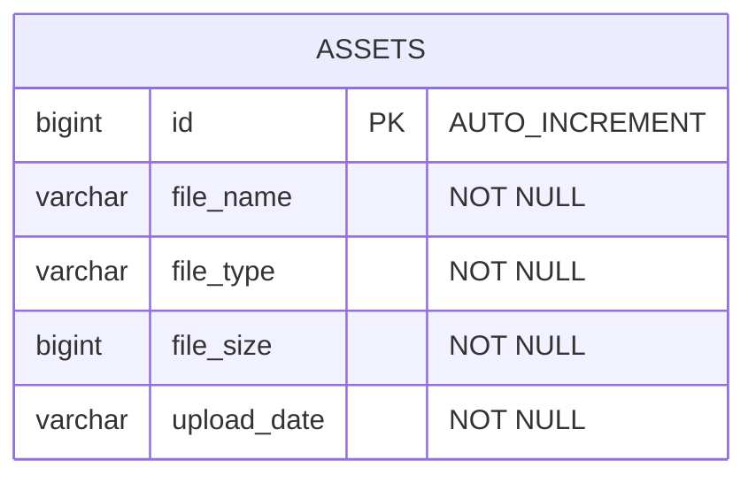
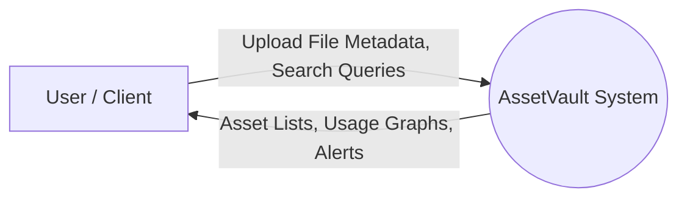
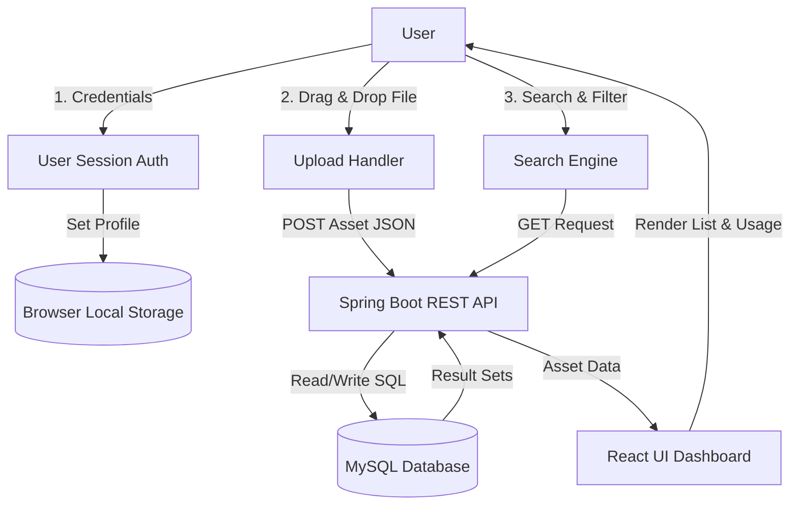

# MINI PROJECT DOCUMENTATION REPORT

## PROJECT TITLE:
### ASSETVAULT – ENTERPRISE DIGITAL ASSET MANAGEMENT SYSTEM

---

**A Mini Project Report submitted in partial fulfillment of the requirements for the award of the degree of**
**Bachelor of Technology (B.Tech) in Computer Science & Engineering**

---

### Submitted By:
**Name:** [Student Name]  
**Roll No:** [Student Roll Number]  
**Branch:** Computer Science & Engineering  

### Under the Guidance of:
**Guide Name:** [Faculty Guide Name]  
**Designation:** Assistant Professor / Associate Professor  

---

<br>
<div align="center">
  
  <br>
  <strong>DEPARTMENT OF COMPUTER SCIENCE AND ENGINEERING</strong>  
  <strong>[COLLEGE / UNIVERSITY NAME]</strong>  
  <strong>ACADEMIC YEAR: 2025 – 2026</strong>
</div>

---
\pagebreak

## TABLE OF CONTENTS

1. **Title Page**
2. **Abstract**
3. **Introduction**
   * 3.1 What is Digital Asset Management (DAM)?
   * 3.2 Importance of Organizing Digital Assets
   * 3.3 Need for a Centralized Management System
4. **Problem Statement**
5. **Objectives**
6. **Existing System**
   * 6.1 Description of Current Practices
   * 6.2 Limitations and Pitfalls
7. **Proposed System**
   * 7.1 Overview of AssetVault
   * 7.2 Core Functional Pillars
8. **System Architecture**
   * 8.1 Architecture Framework (Three-Tier Setup)
   * 8.2 Sequence Diagram
   * 8.3 Entity Relationship (ER) Diagram
   * 8.4 Data Flow Diagrams (DFD)
9. **Methodology**
   * 9.1 Software Development Life Cycle (SDLC)
   * 9.2 Frontend Styling and Layout Engineering
   * 9.3 Backend REST API Development
   * 9.4 Database Design and ORM Integration
10. **Modules Description**
    * 10.1 Module 1: Landing Page
    * 10.2 Module 2: User Registration & Login
    * 10.3 Module 3: Dashboard
    * 10.4 Module 4: Assets Management
    * 10.5 Module 5: Upload Management
    * 10.6 Module 6: Settings/Profile Management
11. **Software Requirements**
12. **Hardware Requirements**
13. **Implementation**
    * 13.1 Directory Structures
    * 13.2 Backend Code Implementation
    * 13.3 Frontend Screen Visual Structures (with Screenshot Placeholders)
14. **Sample Input**
15. **Sample Output**
16. **Results and Outcomes**
17. **Advantages**
18. **Future Enhancements**
19. **Conclusion**
20. **References**

---
\pagebreak

## 2. ABSTRACT

In the modern enterprise landscape, digital assets—including documents, reports, images, presentations, and videos—serve as the core repository of organizational knowledge and branding. However, as the volume of these assets increases exponentially, organizations face significant friction in storage management, cataloging, search retrieval, and storage utilization audits. Traditional file-sharing systems and ad-hoc storage techniques lack central indexing, causing issues with duplicate files, security gaps, and storage inefficiency.

This project introduces **AssetVault**, a premium Enterprise Digital Asset Management (DAM) system engineered to resolve these challenges. The system is built on a modern decoupled architecture, combining a responsive Single Page Application (SPA) frontend developed using **React.js, Vite, and Tailwind CSS**, with a performant RESTful backend API powered by **Java and Spring Boot**. Data persistence is managed using a **MySQL** relational database integrated through **Spring Data JPA**.

AssetVault offers a centralized platform where users can securely register, log in, manage profiles, upload files of varying formats, categorize them automatically (into Documents, Images, Videos, or Others), filter them via real-time search queries, and monitor active storage consumption through visual dashboard analytics. The frontend utilizes a premium glassmorphic dark-themed layout, delivering a responsive user experience with real-time API status validation. 

By automating file metadata extraction and cataloging, AssetVault improves productivity, eliminates storage redundancies, and ensures rapid search matching. This documentation outlines the system's design, architecture, modules, and deployment specifications, proving its suitability as an enterprise digital asset ecosystem.

---

## 3. INTRODUCTION

### 3.1 What is Digital Asset Management (DAM)?
Digital Asset Management (DAM) refers to a systematic business process and technological infrastructure used to organize, store, retrieve, and archive digital files. An asset is distinguished from a simple file by the addition of metadata (e.g., file type, size, upload timestamp, ownership, and tags) that makes it identifiable and valuable. A DAM system acts as a single source of truth for an organization's digital media assets.

### 3.2 Importance of Organizing Digital Assets
In an enterprise environment, unstructured digital data accounts for over 80% of all organizational information. Without structured organization, assets are scattered across local drives, email attachments, and personal cloud accounts. Proper organization ensures:
* **Branding Consistency**: Marketing teams can easily locate authorized, high-resolution media.
* **Operational Efficiency**: Staff members do not waste hours searching for technical reports or contract templates.
* **Storage Optimization**: By tracking file sizes and formats centrally, organizations prevent wasteful duplicate uploads.
* **Lifecycle Management**: Assets are systematically tracked from their initial upload, through active use, to final deletion or archiving.

### 3.3 Need for a Centralized Management System
As remote work and multi-department collaborations become standard, localized file systems fail to meet modern scalability demands. A centralized system provides:
1. **Universal Access**: Authorized web client access from any location using standard protocols.
2. **Consistent Security**: Centralized authentication prevents unauthorized file reads and writes.
3. **Resource Analytics**: IT administrators gain a dashboard view of active storage allocation, allowing them to scale database instances before capacity limits are reached.
4. **Fast Querying**: RDBMS indexes enable fast keyword search matching across thousands of asset records, reducing retrieval times from minutes to milliseconds.

---

## 4. PROBLEM STATEMENT

Organizations frequently encounter substantial overhead in managing digital files. The core problems associated with traditional asset management include:

1. **Storage Fragmentation**: Files are stored in silos across individual computers, external drives, and mismatched cloud drives. This lack of centralized storage results in version confusion and data loss.
2. **High Redundancy and Duplication**: Without a central index, different departments repeatedly upload identical files, wasting storage capacity and increasing operational costs.
3. **Inefficient Search and Retrieval**: Searching for files manually requires navigating deep directory trees or relying on slow OS search tools. The absence of metadata tagging makes finding specific files difficult.
4. **Lack of Storage Monitoring**: Administrators cannot easily track overall storage consumption, identify space-hogging files, or monitor individual storage limits, leading to sudden service outages when storage fills up.
5. **Decoupled User Profiles**: The lack of linked user sessions makes it difficult to audit who uploaded which asset, posing security and compliance risks.

AssetVault addresses these challenges by consolidating all assets into a unified repository with central indexing, real-time metadata calculation, automatic categorization, and storage visualization.

---

## 5. OBJECTIVES

The development of AssetVault is guided by the following key technical and functional objectives:

* **Centralize Digital Asset Storage**: Design a single database-driven vault to store, index, and organize multiple file formats (PDFs, images, videos, documents).
* **Provide Secure Asset Management**: Implement secure user registration, profile management, and session-based authentication using local storage sync.
* **Enable Fast Search and Retrieval**: Develop a client-side search system that matches search queries against database metadata indexes instantly.
* **Monitor Storage Utilization**: Create a dashboard interface that displays file counts, recent uploads, and storage utilization percentages relative to a 100 MB standard capacity.
* **Deliver an Elegant User Interface**: Build a responsive dashboard using Tailwind CSS and glassmorphism, featuring real-time API health checks.
* **Implement Decoupled Architecture**: Separate the frontend (React SPA) and backend (Spring Boot REST API) to allow independent deployment and scaling.

---

## 6. EXISTING SYSTEM

### 6.1 Description of Current Practices
Many small-to-medium enterprises and educational departments still rely on basic file storage systems:
* **Local Folder Hierarchies**: Users save files in nested directories on local workstations.
* **Shared Network Drives (NAS/Samba)**: Local servers host shared folders accessible over a local network.
* **General-Purpose Cloud Buckets**: Organizations use unstructured Google Drive or Dropbox folders without custom metadata schemas.

### 6.2 Limitations and Pitfalls
These traditional systems suffer from several core limitations:

| Feature | Existing Systems | AssetVault (Proposed System) |
| :--- | :--- | :--- |
| **Search Mechanism** | Slow, file-name only OS indexing. | Instant metadata keyword matching. |
| **Storage Monitoring** | Manual properties inspection. | Real-time percentage progress bar. |
| **Duplication Control** | None; multiple copies of files exist. | Central database logging checks. |
| **Metadata Tagging** | Limited OS-specific tags. | Structured DB records (size, date, type). |
| **User Access Control** | Complex network permissions. | Web-based authentication and user profiles. |
| **Interface Quality** | Default system file browsers. | Custom premium dashboard with analytics. |

---

## 7. PROPOSED SYSTEM

The proposed system, **AssetVault**, is a modern web-based Enterprise Digital Asset Management solution. It is designed to act as a centralized system that runs over standard HTTP protocols.

```
+---------------------------------------------------------+
|                    Proposed System                      |
|                                                         |
|  [React Frontend] <==== REST API ====> [Spring Boot]   |
|         |                                    |          |
|  Tailwind UI & States                  JPA & MySQL      |
+---------------------------------------------------------+
```

### 7.1 Overview of AssetVault
AssetVault separates the user interface from data processing. The user interacts with a React web client, which communicates with a Spring Boot REST API. The API processes requests and performs CRUD operations on a MySQL database.

### 7.2 Core Functional Pillars
* **Asset Categorization**: Files are grouped into Documents, Images, Videos, or Others based on their MIME types.
* **Upload Management**: An interactive drag-and-drop interface calculates file attributes (name, MIME type, size in bytes) and uploads them to the server.
* **Storage Monitoring**: A dashboard monitors storage capacity against a 100 MB quota, updating in real time as files are added or deleted.
* **Dashboard Analytics**: Displays key metrics, including total asset count, total storage used, and recent uploads (added within the last 7 days).
* **Search and Filtering**: Interactive search bar and category tabs allow users to filter assets dynamically.

---

## 8. SYSTEM ARCHITECTURE

### 8.1 Architecture Framework (Three-Tier Setup)
AssetVault uses a decoupled three-tier architecture that separates the presentation, application logic, and data layers:

1. **Presentation Layer (Frontend Client)**: Built using **React.js**, **Vite**, and **Tailwind CSS**. This layer runs in the user's browser, managing UI state, client-side routing via React Router, and local settings storage.
2. **Application Logic Layer (Backend Server)**: Powered by **Spring Boot**. This layer exposes RESTful endpoints (GET, POST, DELETE) under `/assets`, validates inputs, and connects to the database via Spring Data JPA.
3. **Data Layer (Relational Database)**: Powered by **MySQL**. This layer stores the metadata schema for all assets, ensuring transaction safety (ACID compliance) and persistent storage.



### 8.2 Sequence Diagram
The sequence diagram below illustrates the process of uploading an asset:



### 8.3 Entity Relationship (ER) Diagram
AssetVault uses a relational schema. The `assets` table tracks file properties:



### 8.4 Data Flow Diagrams (DFD)

#### Level 0 DFD (System Context Diagram)
Shows the boundaries of the AssetVault system and its interactions with external users:



#### Level 1 DFD (Sub-Process Breakdown)
Shows the internal flow of data within the system's core modules:



---

## 9. METHODOLOGY

### 9.1 Software Development Life Cycle (SDLC)
AssetVault was developed using an **Agile Scrum Methodology**, broken down into specific phases:
1. **Requirements Gathering**: Identified the need for centralized digital asset storage, search filters, and storage tracking.
2. **System Design**: Drafted a relational database schema and designed a glassmorphic dashboard interface.
3. **Backend API Development**: Built the database models and controllers in Java, implementing CORS mappings for frontend communication.
4. **Frontend Development**: Developed React components (Sidebar, Dashboard, Uploads, Assets, Settings) using Tailwind CSS.
5. **System Integration**: Connected the React application to the Spring Boot REST API using environment variables.
6. **Testing and Validation**: Verified API endpoints, search performance, and file upload validation.

### 9.2 Frontend Styling and Layout Engineering
To deliver a premium look and feel, AssetVault uses a dark-themed UI built with Tailwind CSS:
* **Background Grid**: A subtle CSS grid overlay (`bg-mesh-grid`) provides visual depth.
* **Radial Glow Effects**: HSL cyan and pink radial gradients create a modern glow effect.
* **Glassmorphism**: Panels use translucent backgrounds (`backdrop-blur-md` and `bg-white/5`) to create layered UI elements.

### 9.3 Backend REST API Development
The backend is structured around Spring Boot's standard **Controller-Repository** pattern:
* **Asset Entity**: A JPA-annotated model that maps database columns to Java fields.
* **Asset Repository**: Extends `JpaRepository` to provide built-in CRUD operations.
* **Asset Controller**: Exposes REST endpoints (`GET /assets`, `POST /assets`, `DELETE /assets/{id}`) and implements `@CrossOrigin` to handle cross-origin requests from the React client.

### 9.4 Database Design and ORM Integration
Database operations are handled using Object-Relational Mapping (ORM) through **Hibernate**:
* **Connection Pooling**: Uses HikariCP to manage database connections efficiently.
* **Table Generation**: Schema updates are managed automatically via Hibernate's DDL configuration:
  `spring.jpa.hibernate.ddl-auto=update`
* **Data Persistence**: Java object updates are translated into SQL statements automatically, eliminating the need to write manual SQL queries.

---

## 10. MODULES DESCRIPTION

### 10.1 Module 1: Landing Page
* **Purpose**: Serves as the application's entry point, highlighting key features and providing navigation links.
* **Functionality**:
  * Displays feature cards (Secure Storage, Smart Search, Cloud Ready).
  * Shows a mock dashboard preview with database-connected stats.
  * Connects to the backend REST API to display real-time storage metrics.
* **Workflow**:
  1. The user navigates to the application root (`/`).
  2. The page fetches current database metrics from the backend.
  3. The page displays the statistics, and the user can navigate to the registration or login page.

### 10.2 Module 2: User Registration & Login
* **Purpose**: Handles user access and initializes application sessions.
* **Functionality**:
  * Validates credentials (e.g., email format and minimum password length).
  * Persists session details in local storage.
  * Dynamically updates user profile information across the sidebar and dashboard.
* **Workflow**:
  1. The user inputs their email and password.
  2. The system validates the inputs and updates the browser session state.
  3. The application dispatches a synchronization event and redirects the user to the dashboard.

### 10.3 Module 3: Dashboard
* **Purpose**: Provides a visual overview of system statistics and storage capacity.
* **Functionality**:
  * Displays key metrics: Total Assets, Storage Used, and Recent Uploads (past 7 days).
  * Shows a progress bar indicating storage usage relative to the 100 MB limit.
  * Displays a list of the 5 most recently uploaded assets.
  * Includes a real-time API health status indicator (Online/Offline/Connecting).
* **Workflow**:
  1. The page loads and calls the `GET /assets` endpoint.
  2. The system computes usage metrics and updates the progress bar.
  3. If the backend is unreachable, the page displays a connection error alert.

### 10.4 Module 4: Assets Management
* **Purpose**: Allows users to search, filter, preview, and delete files.
* **Functionality**:
  * Displays all assets in a structured data grid.
  * Filters files dynamically based on search queries and category tabs (Documents, Images, Videos, Others).
  * Provides a details modal showing metadata like file type, size, and upload date.
  * Allows users to delete assets, which calls the `DELETE /assets/{id}` API endpoint.
* **Workflow**:
  1. The user enters a search term or clicks a category tab.
  2. The system filters the asset list dynamically.
  3. Clicking "Delete" prompts a confirmation dialog, sends a request to the database, and updates the UI.

### 10.5 Module 5: Upload Management
* **Purpose**: Handles file uploads and saves file metadata.
* **Functionality**:
  * Provides a drag-and-drop file upload zone.
  * Calculates file attributes (size, MIME type, upload timestamp) client-side.
  * Shows a simulated upload progress bar.
  * Sends file metadata to the backend using `POST /assets`.
* **Workflow**:
  1. The user drags a file into the upload zone or selects one via the file browser.
  2. The system displays file details and shows a "Confirm & Upload" button.
  3. Clicking upload starts the upload process, sends the data to the API, and displays a success alert.

### 10.6 Module 6: Settings/Profile Management
* **Purpose**: Allows users to manage their profile details and application preferences.
* **Functionality**:
  * Displays editable user profile fields (Full Name, Email Address, Role).
  * Saves changes to local storage and updates the sidebar in real time.
  * Includes a mock security section for password updates.
* **Workflow**:
  1. The user navigates to the Settings page and updates their profile details.
  2. Clicking "Save Changes" updates the local storage keys and dispatches a profile update event.
  3. The sidebar and headers refresh automatically to show the updated profile information.

---

## 11. SOFTWARE REQUIREMENTS

The development and execution environment for AssetVault requires the following software components:

| Software | Version Required | Purpose |
| :--- | :--- | :--- |
| **Operating System** | Windows 10 / 11 | Development host environment. |
| **Integrated Development Env (IDE)** | VS Code 1.90+ | Code editor for React and Spring Boot. |
| **Java Development Kit (JDK)** | JDK 17 (LTS) | Runtime environment for the Spring Boot backend. |
| **Node.js** | Node.js 18+ | Package manager and runner for the Vite frontend. |
| **Database Server** | MySQL Community Server 8.0+ | Relational database to store asset metadata. |
| **Web Browser** | Chrome, Edge, or Firefox | Renders the React client application. |

---

## 12. HARDWARE REQUIREMENTS

The minimum and recommended hardware configurations for the development host:

* **Processor**: Intel Core i5 / AMD Ryzen 5 or higher.
* **Memory (RAM)**: 8 GB RAM minimum (16 GB recommended to run React dev server, Spring Boot, and MySQL concurrently).
* **Storage**: 500 MB of free storage space for project files and dependencies.
* **Network**: Active local network connection (localhost loopback) for API calls.

---

## 13. IMPLEMENTATION

### 13.1 Directory Structures

#### Spring Boot Backend Structure
```
assetvault-backend/
├── pom.xml
└── src/
    └── main/
        ├── java/
        │   └── com/
        │       └── assetvault/
        │           ├── AssetvaultBackendApplication.java
        │           ├── controller/
        │           │   ├── AssetController.java
        │           │   └── HomeController.java
        │           ├── entity/
        │           │   └── Asset.java
        │           └── repository/
        │               └── AssetRepository.java
        └── resources/
            └── application.properties
```

#### React Frontend Structure
```
src/
├── main.jsx
├── App.jsx
├── index.css
├── App.css
├── components/
│   └── Sidebar.jsx
└── pages/
    ├── LandingPage.jsx
    ├── LoginPage.jsx
    ├── RegisterPage.jsx
    ├── Dashboard.jsx
    ├── Assets.jsx
    ├── Uploads.jsx
    └── Settings.jsx
```

### 13.2 Backend Code Implementation

#### 1. JPA Entity class representing the `assets` table schema:
```java
// File Location: assetvault-backend/src/main/java/com/assetvault/entity/Asset.java
package com.assetvault.entity;

import jakarta.persistence.*;

@Entity
@Table(name = "assets")
public class Asset {

    @Id
    @GeneratedValue(strategy = GenerationType.IDENTITY)
    private Long id;

    private String fileName;
    private String fileType;
    private Long fileSize;
    private String uploadDate;

    public Asset() {}

    public Long getId() { return id; }
    public void setId(Long id) { this.id = id; }

    public String getFileName() { return fileName; }
    public void setFileName(String fileName) { this.fileName = fileName; }

    public String getFileType() { return fileType; }
    public void setFileType(String fileType) { this.fileType = fileType; }

    public Long getFileSize() { return fileSize; }
    public void setFileSize(Long fileSize) { this.fileSize = fileSize; }

    public String getUploadDate() { return uploadDate; }
    public void setUploadDate(String uploadDate) { this.uploadDate = uploadDate; }
}
```

#### 2. Repository Interface for database CRUD execution:
```java
// File Location: assetvault-backend/src/main/java/com/assetvault/repository/AssetRepository.java
package com.assetvault.repository;

import com.assetvault.entity.Asset;
import org.springframework.data.jpa.repository.JpaRepository;
import org.springframework.stereotype.Repository;

@Repository
public interface AssetRepository extends JpaRepository<Asset, Long> {
    // Custom repository query methods can be defined here if required
}
```

#### 3. Rest Controller mapping backend API endpoints:
```java
// File Location: assetvault-backend/src/main/java/com/assetvault/controller/AssetController.java
package com.assetvault.controller;

import com.assetvault.entity.Asset;
import com.assetvault.repository.AssetRepository;
import org.springframework.web.bind.annotation.*;
import java.util.List;

@RestController
@RequestMapping("/assets")
@CrossOrigin(
    origins = "http://localhost:5173",
    methods = {RequestMethod.GET, RequestMethod.POST, RequestMethod.DELETE}
)
public class AssetController {

    private final AssetRepository assetRepository;

    public AssetController(AssetRepository assetRepository) {
        this.assetRepository = assetRepository;
    }

    // Retrieve all asset records
    @GetMapping
    public List<Asset> getAllAssets() {
        return assetRepository.findAll();
    }

    // Add a new asset record
    @PostMapping
    public Asset addAsset(@RequestBody Asset asset) {
        return assetRepository.save(asset);
    }

    // Delete an asset record by ID
    @DeleteMapping("/{id}")
    public String deleteAsset(@PathVariable Long id) {
        if (assetRepository.existsById(id)) {
            assetRepository.deleteById(id);
            return "Asset deleted successfully";
        }
        return "Asset not found";
    }
}
```

---

### 13.3 Frontend Screen Visual Structures

To complete the mini project documentation report, insert screenshots of each active system page into the placeholders below:

#### 1. Landing Page Screen
The landing page introduces the system, showcasing core features and a preview of system statistics.
```
+-----------------------------------------------------------------------------------+
|                                                                                   |
|                                [ SCREENSHOT PLACEHOLDER ]                         |
|                                                                                   |
|                              LandingPage.jsx - Home View                          |
|                                                                                   |
+-----------------------------------------------------------------------------------+
```
* **Placement Guide**: Capture the full landing page interface, showing the glassmorphic navigation bar, the hero title ("Manage, Organize and Secure Digital Assets"), the feature grid, and the dark theme.

#### 2. Login Page Screen
The login screen features email and password validation inputs.
```
+-----------------------------------------------------------------------------------+
|                                                                                   |
|                                [ SCREENSHOT PLACEHOLDER ]                         |
|                                                                                   |
|                              LoginPage.jsx - Auth Interface                       |
|                                                                                   |
+-----------------------------------------------------------------------------------+
```
* **Placement Guide**: Capture the login interface, showing the email/password fields, the "Sign In" button, validation alerts, and background glows.

#### 3. Dashboard Analytics Screen
The main user dashboard displays system statistics and storage capacity.
```
+-----------------------------------------------------------------------------------+
|                                                                                   |
|                                [ SCREENSHOT PLACEHOLDER ]                         |
|                                                                                   |
|                              Dashboard.jsx - Metrics & Stats                      |
|                                                                                   |
+-----------------------------------------------------------------------------------+
```
* **Placement Guide**: Capture the dashboard view, highlighting the stat cards (Total Assets, Storage Used, Recent Uploads), the storage progress bar, and the list of recent files.

#### 4. Assets Repository Screen
Displays the searchable list of uploaded files.
```
+-----------------------------------------------------------------------------------+
|                                                                                   |
|                                [ SCREENSHOT PLACEHOLDER ]                         |
|                                                                                   |
|                              Assets.jsx - Repository Grid                         |
|                                                                                   |
+-----------------------------------------------------------------------------------+
```
* **Placement Guide**: Capture the Assets page view, showing the search bar, category filter tabs (Documents, Images, Videos, Others), the asset table, and the file details modal.

#### 5. Uploads Interface Screen
The upload page handles file selection and uploading.
```
+-----------------------------------------------------------------------------------+
|                                                                                   |
|                                [ SCREENSHOT PLACEHOLDER ]                         |
|                                                                                   |
|                              Uploads.jsx - Drag & Drop Zone                       |
|                                                                                   |
+-----------------------------------------------------------------------------------+
```
* **Placement Guide**: Capture the Uploads page, displaying the drag-and-drop zone, file selection triggers, and the upload progress indicator.

#### 6. Settings Page Screen
The settings page allows users to update their profile and application preferences.
```
+-----------------------------------------------------------------------------------+
|                                                                                   |
|                                [ SCREENSHOT PLACEHOLDER ]                         |
|                                                                                   |
|                              Settings.jsx - Profile Panel                         |
|                                                                                   |
+-----------------------------------------------------------------------------------+
```
* **Placement Guide**: Capture the Settings page, showing user profile fields (Name, Email, Role) and the active mock security configurations.

---

## 14. SAMPLE INPUT

For testing purposes, the system accepts file metadata inputs through JSON payloads sent to the backend.

### Scenario: Uploading Assets

#### 1. PDF Document Metadata
```json
{
  "fileName": "project_report.pdf",
  "fileType": "application/pdf",
  "fileSize": 2516582,
  "uploadDate": "2026-06-24"
}
```

#### 2. PNG Image Metadata
```json
{
  "fileName": "marketing_image.png",
  "fileType": "image/png",
  "fileSize": 1048576,
  "uploadDate": "2026-06-24"
}
```

#### 3. MP4 Video Metadata
```json
{
  "fileName": "demo_video.mp4",
  "fileType": "video/mp4",
  "fileSize": 15728640,
  "uploadDate": "2026-06-24"
}
```

---

## 15. SAMPLE OUTPUT

The backend REST API returns JSON objects representing the status of the database:

### Endpoint: `GET /assets` (Retrieve Asset List)
```json
[
  {
    "id": 1,
    "fileName": "project_report.pdf",
    "fileType": "application/pdf",
    "fileSize": 2516582,
    "uploadDate": "2026-06-24"
  },
  {
    "id": 2,
    "fileName": "marketing_image.png",
    "fileType": "image/png",
    "fileSize": 1048576,
    "uploadDate": "2026-06-24"
  },
  {
    "id": 3,
    "fileName": "demo_video.mp4",
    "fileType": "video/mp4",
    "fileSize": 15728640,
    "uploadDate": "2026-06-24"
  }
]
```

### Endpoint: `POST /assets` (Create Asset - API Response)
```json
{
  "id": 4,
  "fileName": "new_asset_log.txt",
  "fileType": "text/plain",
  "fileSize": 1024,
  "uploadDate": "2026-06-24"
}
```

### Endpoint: `DELETE /assets/4` (Delete Asset - API Response)
```
"Asset deleted successfully"
```

---

## 16. RESULTS AND OUTCOMES

The development of AssetVault achieved the following key results:

1. **Successful File Upload & Registration**: Files uploaded via the frontend are saved as metadata records in the MySQL database.
2. **Dynamic Categorization**: Assets are grouped into distinct categories (Documents, Images, Videos, Others) based on their MIME type, simplifying repository navigation.
3. **Real-Time Storage Calculation**: The dashboard updates storage usage metrics instantly when assets are added or deleted.
4. **Keyword Search matching**: The client-side search matches queries against the asset list in real time.
5. **Session Persistence**: User profile details saved on the Settings page persist across browser refreshes using local storage.
6. **Robust Error Handling**: The frontend alerts the user with a custom banner if the backend API is unreachable or offline.

---

## 17. ADVANTAGES

AssetVault offers several distinct advantages over traditional systems:

* **Improved Organization**: Dynamic category filters group assets automatically, eliminating manual folder management.
* **Faster Search**: Real-time filtering scans the asset list as the user types, returning matching files in milliseconds.
* **Clear Storage Visibility**: Interactive capacity bars show active usage relative to limits, helping prevent storage overruns.
* **Separation of Concerns**: The decoupled React and Spring Boot architecture ensures the system is modular and easy to maintain.
* **User-Friendly Interface**: The modern dark theme and glassmorphic layout provide an intuitive, professional user experience.

---

## 18. FUTURE ENHANCEMENTS

Planned updates for future versions of AssetVault include:

* **Direct Cloud Storage Integration**: Integrate AWS S3 or Azure Blob Storage to host physical files, saving only file URLs in the MySQL database.
* **JWT Authentication**: Replace local storage sessions with JSON Web Tokens (JWT) and Spring Security configuration.
* **Role-Based Access Control (RBAC)**: Define user roles (e.g., Administrator, Contributor, Viewer) to restrict upload and deletion privileges.
* **AI-Based Tagging**: Implement AI pipelines to analyze images and auto-generate tags during upload.
* **Advanced Analytics**: Add graphs to show storage trends over time and break down space usage by file format.

---

## 19. CONCLUSION

AssetVault successfully addresses the challenges of digital asset management. By combining a **React SPA frontend** with a **Spring Boot REST API** and a **MySQL database**, the system provides a reliable, secure, and fast platform for managing digital assets.

Key features like automatic file categorization, keyword search filtering, and storage usage tracking simplify asset organization and help optimize resource allocation. The decoupled architecture provides a scalable foundation for future enhancements, such as cloud storage integration and advanced user access controls, making AssetVault a solid solution for enterprise digital asset management.

---

## 20. REFERENCES

### 20.1 Official Documentation
1. **React.js Documentation**: Official guides on state management, hooks, and component life cycles.  
   *URL: [https://react.dev](https://react.dev)*
2. **Spring Boot Documentation**: Reference guides on Spring Web REST APIs, controllers, and beans.  
   *URL: [https://spring.io/projects/spring-boot](https://spring.io/projects/spring-boot)*
3. **MySQL Reference Manual**: MySQL 8.0 schema reference, indexing, and connection pools.  
   *URL: [https://dev.mysql.com/doc](https://dev.mysql.com/doc)*
4. **Tailwind CSS Documentation**: Grid, layout, and color utility specifications.  
   *URL: [https://tailwindcss.com/docs](https://tailwindcss.com/docs)*

### 20.2 Academic Books
5. **Enterprise Integration Patterns** by Gregor Hohpe and Bobby Woolf (Addison-Wesley).
6. **Java Persistence with Hibernate** by Christian Bauer and Gavin King (Manning Publications).
7. **Clean Architecture: A Craftsman's Guide to Software Structure and Design** by Robert C. Martin (Prentice Hall).
